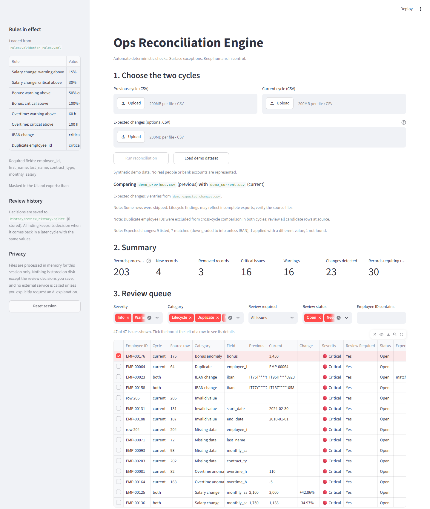
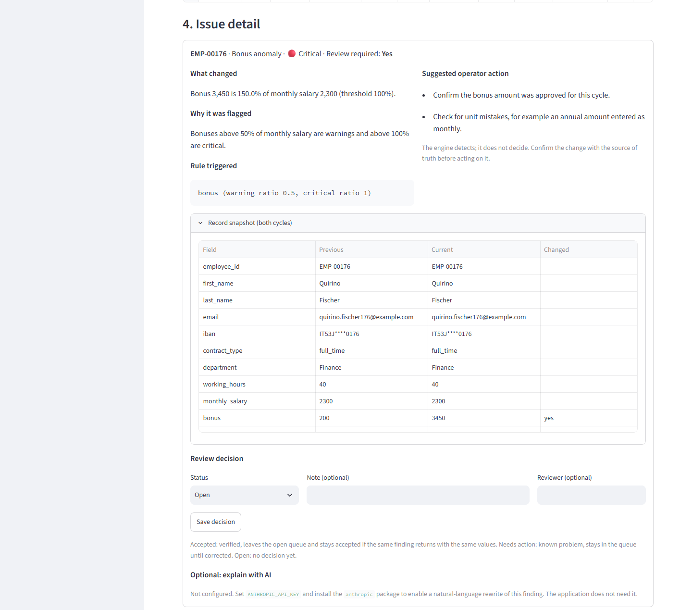

# Ops Reconciliation Engine

A small internal tool that compares two recurring exports of the same dataset,
detects what changed, what is missing, what is duplicated and what looks
wrong, and turns the result into a review queue for a human operator.

The demo uses a synthetic HR/payroll-like dataset because it is a familiar
example of a recurring operational export. **This is not payroll software.**
It does not calculate salaries, taxes, contributions or payslips. The same
engine works conceptually for inventory snapshots, supplier catalogues, CRM
exports, subscription records or any other dataset that arrives on a cycle
and has a stable record key.





## The problem

Operations teams receive the same export every week or month and have to
answer the same questions each time: which records are new, which
disappeared, which values changed, what is missing, what is duplicated, and
which of those changes need a second look before anything downstream runs.

Most teams do this in a spreadsheet: sort both files, VLOOKUP one against the
other, eyeball the differences. It is slow, it is repetitive, and it is easy
to miss the one row that matters. The checks themselves are deterministic;
only the decision about what to do with a finding needs human judgement.

## Product principle

**Automate deterministic checks. Surface exceptions. Keep humans in control
of decisions that require context.**

The engine is responsible for *detection*. It compares values, applies
configured thresholds and produces a structured, explainable finding. It is
never responsible for the *decision*. A 40% salary increase might be a
promotion or a typo; an IBAN change might be a legitimate request or fraud.
The tool cannot know, so it does not pretend to. It flags, explains and
exports, and a person decides.

## Example workflow

```
Previous dataset       Current dataset
        \                  /
         v                v
          Load & validate (structure, encoding, columns, types)
                     |
                     v
          Reconcile (match on employee_id, compare fields)
                     |
                     v
          Rules (thresholds from rules/validation_rules.yaml)
                     |
                     v
          Exceptions (typed issues: severity, rule, explanation)
                     |
                     v
          Human review (filterable queue, detail panel)
                     |
                     v
          Export (reconciliation_report.csv, review_required.csv)
```

## Features

- Loads CSV exports with encoding fallback, delimiter detection, header checks
  (duplicate or missing columns) and per-row structure checks; common input problems
  are reported in plain language.
- Validates each cycle on its own: required fields, numeric and date types,
  duplicate keys, duplicate emails and IBANs, negative salaries, impossible
  dates, end dates before start dates, malformed emails.
- Reconciles the two cycles: new and removed records, salary changes with a
  percentage and configurable severity bands, IBAN changes, contract type,
  working hours and department changes, start date changes, end dates added.
- Flags anomalies in the current cycle: bonus relative to salary, overtime
  outside the plausible range.
- Classifies every finding as INFO, WARNING or CRITICAL and decides whether it
  needs human review, using a policy that lives in the rules file.
- Presents a review queue with filters (severity, category, review required,
  employee ID) and a detail panel that states what changed, why it was
  flagged, which rule fired and what an operator could check.
- Remembers the decision an operator records on a finding (accepted, needs
  action, with a note and reviewer). When the same finding comes back in a
  later cycle it carries that decision: accepted exceptions leave the open
  queue, known problems are shown as such. Stored locally in SQLite.
- Takes an optional list of expected changes (approved raises, transfers,
  leavers, new hires, with a reference). A change that matches an entry is
  downgraded to info, a change to a different value than approved says so,
  and an approval that was never applied becomes a finding of its own.
- Exports the full report and the review queue as CSV, including the review
  status of every finding and how it relates to the expected changes.
- Masks the IBAN field in findings, tables, snapshots and exports; also redacts
  recognizable IBAN text misplaced in other fields. Configured sensitive fields
  are hidden in both value columns and finding messages.
- Optional natural-language explanation of a finding through the Claude API,
  strictly opt-in; the application is complete without it.
- A command-line entry point for scripted or scheduled runs.

## Demo

```bash
streamlit run app.py
```

Click **Load demo dataset** (or open `http://localhost:8501/?demo=1`). The
demo compares 200 synthetic records with the same population one cycle later,
into which about forty changes and data problems were injected on purpose:
salary changes at every severity, IBAN changes, a duplicated employee ID,
missing fields, a row without a key, department and contract changes,
excessive and negative overtime, bonus anomalies, an impossible date, a
malformed email and a structurally broken line. `data/README.md` lists every
injected scenario with its employee ID. The demo also loads
`data/demo_expected_changes.csv`, nine approvals of which seven match, one
was applied with a different value and one never happened.

Everything in `data/` is synthetic and regenerated deterministically by
`scripts/generate_demo_data.py`.

The same run from the command line:

```bash
python -m src.engine data/demo_previous.csv data/demo_current.csv --output-dir reports
```

## Architecture

```
ops-reconciliation-engine/
├── app.py                      Streamlit UI (thin: layout, filters, session state)
├── rules/validation_rules.yaml Business thresholds and severities
├── src/
│   ├── models.py               Issue, Summary, ReconciliationResult, column layout
│   ├── config.py               YAML -> validated Rules object (Pydantic)
│   ├── loader.py               CSV -> clean string DataFrame, structural errors
│   ├── validators.py           Single-cycle checks; produces the typed frame
│   ├── reconciliation.py       Cross-cycle comparison on the record key
│   ├── anomaly_detection.py    Single-cycle bonus and overtime rules
│   ├── engine.py               Orchestrates one run; also a small CLI
│   ├── reporting.py            Summary counts, sorting, CSV exports
│   ├── history.py              Review decisions kept between runs (SQLite)
│   ├── expectations.py         Optional list of approved changes and how findings relate to it
│   ├── explain.py              Template explanations, optional LLM rewrite
│   └── utils.py                Masking, percentage change, formatting
├── sql/                        The same checks written as readable SQL
├── scripts/generate_demo_data.py
├── data/                       Synthetic demo exports
└── tests/                      pytest suite (engine, rules, UI glue, SQL)
```

The data flows through four stages, each a plain function that takes a
DataFrame or two and returns a list of `Issue` objects:

1. **Load** (`loader.py`). Reads bytes, decodes them, finds the delimiter,
   checks the header and row structure, normalises column names and trims
   cells. Returns a string-typed frame plus a source line number per row.
   File-level problems raise `DatasetLoadError` with an operator-readable
   message; row-level problems become issues and the row is skipped.
2. **Validate** (`validators.py`). Coerces numeric and date columns (invalid
   cells become issues), checks required fields, duplicates and impossible
   values. Returns the typed frame the next stages work on.
3. **Reconcile** (`reconciliation.py`). Indexes both cycles by `employee_id`,
   reports records that appeared or disappeared, then compares each matched
   pair field by field. Rows without a key are left to the validators; when a
   key repeats in either cycle, it is excluded from cross-cycle comparisons in
   both cycles and reported as critical, requiring review. All candidate rows
   remain available in the detail snapshot.
4. **Detect anomalies** (`anomaly_detection.py`). Looks at the current cycle
   alone for values that are implausible regardless of history.

`engine.py` runs the four stages, sorts the issues (critical first), attaches
any stored review decision and builds the summary. `app.py` only does layout and session state; it contains no
business logic, which is why the engine can also run from the command line or
from a scheduler.

One shape for every finding keeps everything downstream simple:

```json
{
  "employee_id": "EMP-00125",
  "field": "monthly_salary",
  "previous_value": 2100.0,
  "current_value": 3000.0,
  "change_percentage": 42.857143,
  "rule": "salary_change",
  "severity": "critical",
  "requires_review": true,
  "message": "Monthly salary increased by 42.86% (from 2,100 to 3,000)."
}
```

Value and message builders apply configured field masking. The `Issue` model
also redacts recognizable IBAN text as a defensive output boundary. This is
not general secret detection: do not put unrelated confidential information
in arbitrary text fields.

### SQL examples

`sql/` contains the same operational checks as readable SQL: duplicates,
missing records between periods, month-over-month changes and anomalies. The
Python engine is the implementation; the SQL is there to show that these
checks are ordinary data-literacy work that could run in a warehouse.
`tests/test_sql.py` loads the demo CSVs into an in-memory SQLite database and
runs every statement, so the SQL stays correct as the demo data evolves.

## Business rules

Business thresholds, required fields, review policy and configurable rule
outcomes live in `rules/validation_rules.yaml`, loaded into a validated `Rules`
object. Salary/bonus/overtime severity bands and zero-baseline salary handling
are fixed application semantics. IBAN changes must stay critical and require
review; duplicate IDs must stay critical and require review. Unsafe overrides
are rejected, and IBAN masking is always enabled.

```yaml
salary_change:
  warning_percentage: 15        # change above this (absolute %) is a warning
  critical_percentage: 30       # change above this is critical

bonus:
  warning_salary_ratio: 0.5
  critical_salary_ratio: 1.0

overtime:
  minimum_hours: 0
  warning_hours: 60
  critical_hours: 100

iban_change:
  requires_review: true
  severity: critical

duplicates:
  employee_id: critical
  email: warning
  iban: warning

required_fields:
  - employee_id
  - first_name
  - last_name
  - contract_type
  - monthly_salary

review_policy:                  # which severities land in the review queue
  info: false
  warning: true
  critical: true

history:                        # where operator decisions are kept between runs
  enabled: true
  path: history/review_history.sqlite

expected_changes:               # an approved change that did not happen
  missing_severity: warning
```

Lifecycle events (new, removed, dates) and contract field changes each have
their own severity entry and optional `requires_review` override. Unknown keys are rejected on load so a typo in the
file fails loudly instead of silently reverting to a default; inverted
thresholds are rejected too. If the file is absent the built-in defaults, which
are identical to the shipped file, apply.

Classification uses the unrounded percentage: exactly 15% is INFO, 15.0001%
is WARNING, exactly 30% is WARNING, and 30.0001% is CRITICAL. Decreases are
judged by magnitude. Exports keep six decimal places of percentage precision.
Messages show two decimals, except when that rounding would land exactly on a
configured threshold while the true value does not: a 15.0001% change is
written as 15.0001%, never as 15.00%.

### Review history

A finding is identified by what the operator saw: record, rule, field,
previous and current value as displayed. `history.py` keeps one row per
finding in a SQLite file (`history/review_history.sqlite` by default, set
under `history:` in the rules file) plus an append-only log of every
decision and reversal. On each run the engine looks the current findings up
and attaches the stored status:

- **Accepted**: verified by a person. The finding stays in the full report
  with its status, leaves the review queue and the review count, and is
  hidden by the default status filter.
- **Needs action**: a known problem waiting for a correction at source. It
  stays in the queue, labelled, so nobody re-investigates it from scratch.
- **Open**: no decision yet. Saving "Open" removes a previous decision.

If any of the values change, the fingerprint changes and the finding comes
back as open: a salary accepted at 2,100 to 3,000 is not accepted at 3,000 to
3,200. Nothing is written until an operator saves a decision; the engine never
records or alters one on its own. The same history is applied by the CLI, so a
scheduled run exports the review status too.

### Expected changes

Most legitimate changes are known before the export arrives: an approved
raise, a transfer, a resignation, a new hire. An optional third CSV lists
them so they do not have to be re-investigated:

```csv
employee_id,field,expected_value,reference
EMP-00077,monthly_salary,4779,HR-2024-118 annual review
EMP-00045,end_date,2024-09-30,resignation received 2024-08-12
EMP-00201,new_record,,offer signed 2024-08-30
```

`field` is one of `monthly_salary`, `iban`, `contract_type`, `working_hours`,
`department`, `start_date`, `end_date`, or the lifecycle events `new_record`
and `removed_record` (with an empty `expected_value`). `reference` is free
text shown next to the finding. The engine (`expectations.py`) compares the
raw current value with the expected one, so a raise approved to 3,000 does
not cover a raise to 30,000:

- **Match** (same record, field and value): the finding is downgraded to
  INFO, leaves the review queue and carries the reference. The fact itself
  (percentage, values) is untouched and still exported.
- **IBAN changes are the exception**: an expected IBAN change stays critical
  and is only marked, because bank details are always confirmed by a person.
- **Different value**: the finding keeps its severity and states what was
  approved instead, so the mismatch is visible at a glance.
- **Not applied**: an approval with no matching change becomes a finding
  (`expected_change_missing`, severity `expected_changes.missing_severity`,
  warning by default). An approval whose value is already in place is
  silently satisfied.

Problems in the file (unknown field, duplicate entry, blank ID) are errors,
not skips: the file is small, hand-made and represents approvals, so a
silently ignored row would be worse than a stopped run.

## Human-in-the-loop approach

The engine distinguishes **detection** from **decision**.

Detection is deterministic: the same two files and the same rules always give
the same findings, and every finding names the rule and the threshold that
produced it. That makes the output auditable and the behaviour predictable,
which matters more in an operations tool than cleverness.

Decision is left to the operator, on purpose. Sensitive changes are never
auto-resolved:

- an IBAN change is always critical and always reviewed, whatever else is
  true about the record;
- a large salary change is flagged with its percentage and the threshold it
  crossed, not judged;
- a duplicated employee ID is reported with the rows involved so a person can
  say which one is right.

The detail panel suggests *checks*, not conclusions ("verify the effective
date", "confirm the account holder matches the employee"). The decision the
operator then records is stored as data, with who took it and when, and it
only ever suppresses the identical finding; it never teaches the engine to
skip a rule. The optional AI
explanation follows the same rule: it may rephrase a finding, it may not say
whether the change is legitimate, and the deterministic template is always
there when it is off.

## Why this architecture

The problem is a batch comparison of two recurring files, once per cycle.
A pandas pipeline of plain functions, one YAML file and a single-page Streamlit
app cover the demonstrated workload. Larger datasets need measurement on the
intended deployment machine.

A real-time, event-driven architecture could have been used, but recurring
operational reconciliations do not require that complexity. A batch
reconciliation model provides most of the operational value with dramatically
lower implementation and maintenance cost: no brokers, no consumers, no state
to keep consistent, nothing to run between cycles.

Other choices worth naming:

- **Pydantic for the issue model and the rules**, because typed, validated
  objects at the two boundaries (config in, findings out) catch most mistakes
  early and cost almost nothing.
- **One flat list of issues** rather than per-check result types. Every
  consumer (table, filters, exports, tests) deals with one shape.
- **Rules in YAML, schema in code.** Thresholds change often and should not
  need a deployment; the column layout of a dataset changes rarely and needs
  code changes anyway.
- **Streamlit** because the audience is internal, the interaction is simple
  (upload, look, filter, download) and a framework with routing, auth and a
  build step would be more to maintain than the engine itself.
- **A small CLI next to the UI**, so the same engine can run on a schedule or
  in a script without touching the front end.

## What I deliberately did not build

- **No microservices.** The engine is a local pipeline of plain
  functions; splitting them across services would add network failure modes
  and deployment work with no gain.
- **No distributed architecture.** The demonstrated workload fits a single
  process. Measure larger workloads before choosing more infrastructure.
- **No real-time event bus.** Exports arrive on a cycle. Nothing needs to
  react in milliseconds.
- **No autonomous AI decision-making.** The model, when enabled, explains a
  finding the engine has already made. It cannot accept, dismiss, reclassify
  or hide anything, and the tool works identically without it.
- **No payroll calculation engine.** The tool compares values it is given. It
  has no opinion on what a salary, bonus or contribution *should* be, and
  encodes no knowledge of any country's payroll rules.
- **No persistence of uploads or results.** Files are processed in memory
  for the session. The one thing kept between runs is the review decision an
  operator saves, because without it the same exceptions come back every
  cycle. It is a single local SQLite file, easy to inspect or delete.
- **No authentication.** An internal tool run on a laptop or behind an
  existing gateway does not need its own user database. Adding one would be
  the wrong layer to solve access control at.

## Running locally

Requirements: Python 3.12 or newer. Verified locally with Python 3.14.4 and
Streamlit 1.64; Python 3.12 is not covered by a CI version matrix yet.

```bash
git clone <repository-url>
cd ops-reconciliation-engine
python -m venv .venv
# Windows: .venv\Scripts\activate    macOS/Linux: source .venv/bin/activate
pip install -r requirements.txt
streamlit run app.py
```

The browser opens at `http://localhost:8501`. Click **Load demo dataset**, or
upload your own previous and current CSV exports with the columns described
below.

Expected columns (header names are case-insensitive, spaces become
underscores): `employee_id`, `first_name`, `last_name`, `email`, `iban`,
`contract_type`, `department`, `working_hours`, `monthly_salary`, `bonus`,
`overtime_hours`, `start_date`, `end_date`. The required ones are those in
`required_fields`; the others may be absent. Comparisons of an absent column
are skipped in both cycles, while single-cycle checks still use available
values. Notes identify absent columns. Blank cells in present columns remain
actual missing values, so an explicitly cleared IBAN is still a critical change. Dates are expected as
`YYYY-MM-DD` (configurable in the rules file).

Command-line run, useful for scripts and schedulers:

```bash
python -m src.engine previous.csv current.csv --output-dir reports
```

With a list of approved changes:

```bash
python -m src.engine previous.csv current.csv --expected approved_changes.csv --output-dir reports
```

Regenerate the demo data:

```bash
python scripts/generate_demo_data.py
```

## Running tests

```bash
python -m pytest
```

The suite covers the loader (encodings, delimiters, headers, malformed rows),
every validation and reconciliation rule including threshold boundaries, IBAN
masking and change detection, bonus and overtime thresholds, date validation,
malformed data handling, rules loading, exports, the explanation templates,
the SQL examples and the UI glue (headless, through Streamlit's `AppTest`).
Coverage is concentrated on the engine on purpose; the Streamlit layout code
is exercised only enough to know the demo flow, error messages and masking
work.

```bash
python -m pip install pytest-cov ruff
python -m pytest --cov=src --cov-report=term-missing
python -m ruff check .
```

## Privacy considerations

The demo data is synthetic, but the tool is designed as if it were not:

- **IBAN masking.** Bank identifiers are masked (`IT60X****3456`) before they
  are stored in a finding. Recognizable IBAN text misplaced in other fields
  is also redacted. Additional fields to hide are configured in the rules file;
  IBAN masking cannot be disabled. The record key must remain visible for review.
- **No persistent storage of data.** Uploads and results live in the
  Streamlit session in memory and disappear when the session ends. The CLI
  writes only the two report files you ask for.
- **Review decisions are the one thing stored.** Saving a decision writes
  the record key, rule, field, the masked values as shown, the status, your
  note, the reviewer name and a timestamp to the SQLite file configured under
  `history`. Notes are free text: do not paste confidential data into them.
  Delete the file to forget every decision, or set `history.enabled: false`.
- **The expected changes file** is processed in memory like the two cycles.
  IBANs it contains are compared in full but never shown in full.
- **No external calls by default.** The engine runs entirely locally. The
  only network call the code can make is the optional AI explanation, which
  requires an API key to be set explicitly and is triggered per finding by a
  button. Streamlit usage telemetry is disabled in `.streamlit/config.toml`. What it sends is the masked finding and the template explanation.
- **No logging of values.** Normal operation logs counts only (rows loaded,
  issues found). Unexpected failures log a generic message without exception
  values and show an operator-friendly error.
- **Names appear in the UI** where they help an operator identify a record
  (the record snapshot, new/removed messages). Add `first_name` and `last_name`
  to `masked_fields` to hide them. Optional AI sends the displayed finding and
  template, which can contain other personal fields; review your configuration
  before using it. Text cells beginning with spreadsheet formula prefixes are
  apostrophe-prefixed in CSV exports so they are treated as text.

## Optional AI explanations

Explanations in the detail panel are generated from templates and are always
available. To additionally get a natural-language rewrite of a finding:

```bash
pip install anthropic
export ANTHROPIC_API_KEY=...        # Windows: set ANTHROPIC_API_KEY=...
streamlit run app.py
```

An **Explain this finding** button then appears in the detail panel. The
model receives the masked finding and the template explanation (including
relevant rule thresholds), and is instructed not to judge whether the change is correct
and not to invent facts. If the request fails for any reason (no network,
bad key, rate limit, refusal) the UI shows a one-line reason and the template
explanation stands. Set `OPS_RECON_LLM_MODEL` to a model available to your account. Live provider
compatibility has not been verified in this audit; SDK interactions are tested
with offline fakes. Templates remain the authoritative explanation.

## Known limitations

- The record key is fixed to `employee_id` and the column layout is defined
  in code (`src/models.py`). Using the engine for a different dataset means
  editing that module and the rule functions that reference specific columns.
- Numbers must use a dot as decimal separator; `2.100,50` is reported as
  invalid rather than guessed at.
- When an `employee_id` repeats in either cycle, cross-cycle comparisons for
  that ID are skipped until the source is corrected. All rows still receive
  single-cycle validation; no candidate is treated as authoritative.
- Malformed rows are skipped and reported. New/removed findings in an incomplete
  export need source verification and a rerun after the export is corrected.
- Empty/header-only files are rejected; a fully empty cycle is not supported.
- Bonus ratios with zero or missing salary are undefined and skipped; negative
  bonus amounts have no separate anomaly rule in this MVP.
- A date that becomes unparseable is reported twice, once as an invalid value
  and once as a change to empty. This is deliberate (the second finding
  survives even if the date column is not required) but adds a line to the
  queue.
- Runs themselves are not stored, only decisions. A decision is matched on the
  values as displayed (masked for IBANs), so two different changes with the
  same masked rendering would share it; findings on rows without an ID are
  matched by row number, which shifts if the export changes shape.
- Large-file throughput has not been benchmarked reproducibly here. The review
  table is not paginated; use CSV exports for large queues.
- SQL examples illustrate individual checks on cleaned data. They are not a
  second implementation of all validation, duplicate-resolution or configurable
  rules behavior.

## Future improvements

None of these exist today.

- Configurable schemas: declare the key field, column types and masked
  fields per dataset so the same engine serves inventory or CRM exports
  without code changes.
- Reusable reconciliation templates: a rules file per dataset type.
- Connectors that pull the two cycles from an API, a database or object
  storage instead of manual uploads.
- Scheduled reconciliations with a notification when the review queue is not
  empty.
- Role-based access control if the tool moves behind a shared deployment.
- Run history: keep past summaries so a cycle can be compared with the ones
  before it, not only with the previous export.
- Anomaly trend analysis across cycles (a salary that drifts 10% every month
  is more interesting than any single 10% change), building on the run
  history above.
- Pagination and column sorting in the review table for very large exports.
