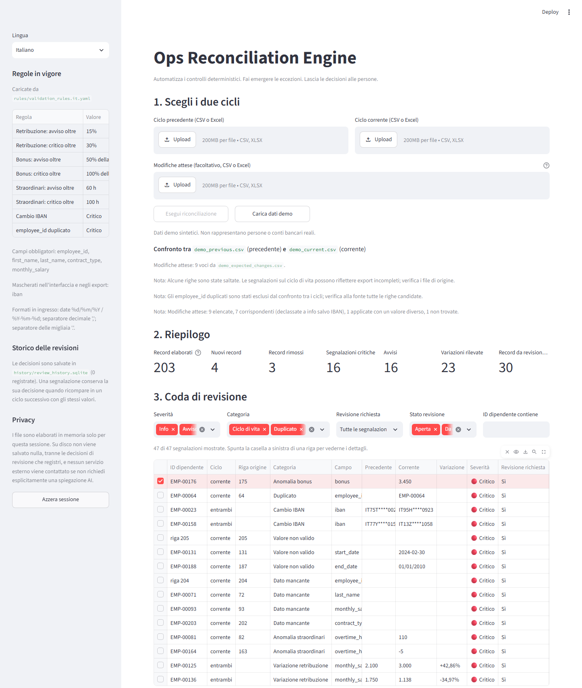
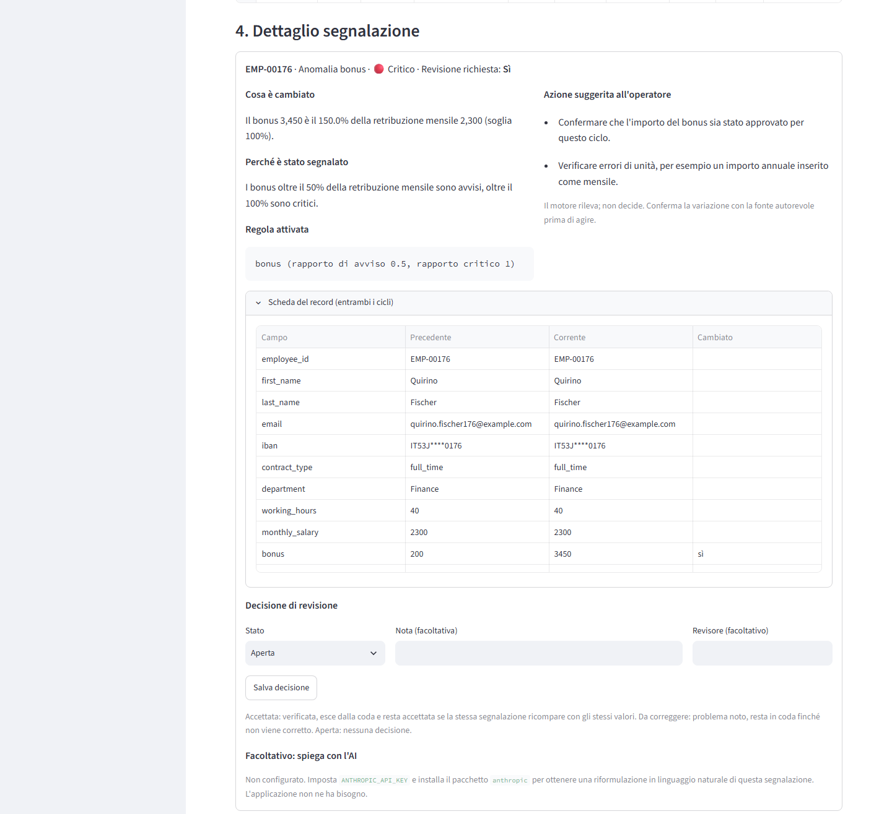

# Ops Reconciliation Engine

Uno strumento interno che confronta due export ricorrenti dello stesso dataset,
per esempio l'anagrafica del personale di due mesi consecutivi, trova cosa è
cambiato, cosa manca, cosa è duplicato e cosa non torna, e lo trasforma in una
coda di revisione per un operatore.

> **Principio:** automatizzare i controlli deterministici, far emergere le
> eccezioni, lasciare alle persone le decisioni che richiedono contesto.



## Il problema che affronta

Ogni mese, o ogni settimana, un team operations riceve lo stesso export:
personale, fornitori, inventario, clienti. E ogni volta deve rispondere alle
stesse domande. Chi è entrato, chi è uscito, quali valori sono cambiati, dove
mancano dati, cosa è stato inserito due volte, quali variazioni meritano una
verifica prima che il file passi al passo successivo.

Di solito il confronto si fa in Excel: si ordinano i due file, si incrociano
con un CERCA.VERT, si scorrono le differenze a occhio. È lento, è ripetitivo e
l'errore tipico non è sbagliare un controllo, è dimenticarne uno. I controlli
in sé sono meccanici; solo la decisione su cosa fare con una differenza
richiede una persona.

## Cosa fa, in concreto

1. **Si caricano due file** (CSV o Excel): il ciclo precedente e quello corrente.
2. **Ogni file viene controllato da solo**: colonne obbligatorie presenti,
   campi vuoti, numeri e date leggibili, ID duplicati, email o IBAN condivisi
   tra persone diverse, valori impossibili (stipendio negativo, data di fine
   prima della data di inizio).
3. **I due file vengono confrontati** record per record: nuovi ingressi,
   uscite, variazioni di retribuzione con la percentuale, cambi di IBAN, di
   contratto, di orario, di reparto, date modificate.
4. **Ogni segnalazione riceve una severità** (info, avviso, critico) secondo
   soglie scritte in un file di regole modificabile senza programmare, e
   l'indicazione se richiede una revisione umana.
5. **L'operatore lavora su una coda** filtrabile per severità, categoria e
   stato; per ogni riga vede cosa è cambiato, perché è stato segnalato, quale
   regola è scattata e quali verifiche fare.
6. **Si esporta** il report completo e la sola coda di revisione in CSV.

Due funzioni in più per chi lo usa ogni mese:

- **Le decisioni vengono ricordate.** Una segnalazione accettata non torna in
  coda al ciclo successivo se i valori sono gli stessi; un problema noto resta
  segnalato come tale finché non viene corretto alla fonte. Ogni decisione ha
  autore, data e nota.
- **Le modifiche già approvate si dichiarano prima.** Un terzo file con gli
  aumenti, i trasferimenti, le uscite e le assunzioni approvate abbassa a
  informativa la segnalazione corrispondente; una modifica applicata con un
  valore diverso da quello approvato viene evidenziata; un'approvazione mai
  applicata diventa una segnalazione a sua volta.

## Cosa risolve

Sul dataset dimostrativo incluso (203 record sintetici, 47 segnalazioni, 30
record da revisionare) lo strumento porta in cima alla coda, senza che nessuno
debba cercarli:

| Situazione | Esito |
|---|---|
| L'IBAN di un dipendente è cambiato | Critico, sempre da confermare da una persona, mai mostrato per intero |
| Retribuzione da 2.100 a 3.000 (+42,86%) | Critico; un +8% resta informativo |
| Lo stesso ID esportato due volte con due stipendi diversi | Critico, escluso dal confronto finché la fonte non è corretta |
| Un dipendente presente il mese scorso e assente oggi | Avviso |
| 110 ore di straordinario, bonus pari al 150% dello stipendio | Anomalie con la soglia superata indicata |
| Data `30/02/2024`, campo obbligatorio vuoto, riga rotta nel file | Segnalati con un messaggio leggibile, mai con un errore tecnico |
| Aumento approvato e applicato con lo stesso importo | Declassato a informativa, con il riferimento dell'approvazione |
| Trasferimento approvato ma mai applicato | Segnalato come approvazione non applicata |



## Cosa non fa, di proposito

- **Non è un software paghe.** Non calcola cedolini, contributi o imposte e non
  incorpora regole contrattuali. Confronta i valori che riceve con quelli del
  ciclo precedente e con le aspettative dell'azienda; il resto lo fanno i
  gestionali e i consulenti.
- **Non decide.** Nessuna correzione automatica e nessuna intelligenza
  artificiale che giudica se una variazione è legittima. La spiegazione
  facoltativa generata da un modello linguistico, se attivata, riformula una
  segnalazione già prodotta dal motore e non può cambiarne l'esito.
- **Non manda dati fuori.** Tutto gira sul computer in cui è installato, senza
  servizi esterni. I file caricati restano in memoria e spariscono a fine
  sessione; l'unica cosa salvata su disco sono le decisioni che l'operatore
  sceglie di registrare.

## Provarlo in cinque minuti

Serve Python 3.12 o successivo.

```bash
git clone https://github.com/monellonasti/ops-reconciliation-engine.git
cd ops-reconciliation-engine
pip install -r requirements.txt
streamlit run app.py
```

Nel browser: **Carica dati demo**. Per l'interfaccia e i formati italiani
(virgola decimale, date `GG/MM/AAAA`) si imposta prima il profilo:

```bash
set OPS_RECON_RULES=rules/validation_rules.it.yaml
```

(`export` al posto di `set` su macOS e Linux.) I dati di prova sono interamente
inventati; nessuna persona reale è rappresentata.

Per usare i propri file bastano due export con le stesse colonne del demo
(`employee_id`, `first_name`, `last_name`, `email`, `iban`, `contract_type`,
`department`, `working_hours`, `monthly_salary`, `bonus`, `overtime_hours`,
`start_date`, `end_date`); le colonne non obbligatorie possono mancare.

## Come è costruito, in breve

- Python con pandas e Streamlit, nessuna infrastruttura da installare o gestire.
- Un solo file di regole (`rules/validation_rules.yaml`), leggibile: soglie
  percentuali, campi obbligatori, severità, formati di numeri e date, lingua.
  Un profilo italiano pronto in `rules/validation_rules.it.yaml`.
- Lo stesso motore gira da riga di comando, quindi può essere programmato
  (per esempio ogni primo del mese) e produrre i report senza interfaccia.
- Una suite di test automatici (399 al 28 settembre 2026, eseguibile con
  `python -m pytest`) copre le regole di confronto, le soglie, il
  mascheramento dei dati sensibili e la gestione dei file malformati.
- Il progetto è stato sottoposto a una revisione indipendente del codice; i
  problemi trovati e le correzioni sono documentati in [`AUDIT.md`](AUDIT.md).
  L'audit precede le tre funzioni aggiunte dopo (storico delle decisioni,
  modifiche attese, lingua e formati italiani), quindi i suoi conteggi, 271
  test al termine delle correzioni, sono quelli di quella data.

## Limiti attuali

- La struttura delle colonne è quella dell'esempio HR; usare lo strumento su
  fornitori o inventario richiede oggi una modifica al codice, non solo alle
  regole.
- Con un ID duplicato nessuna delle righe viene considerata autorevole: il
  confronto per quell'ID viene sospeso finché la fonte non è corretta.
- Non c'è uno storico delle esecuzioni, solo delle decisioni; l'andamento di
  un valore su più mesi non viene analizzato.
- La tabella non è paginata: con code molto lunghe è più comodo lavorare
  sull'export CSV.

## Per approfondire

- [Documentazione tecnica](docs/TECHNICAL.md) (in inglese): architettura,
  regole, scelte progettuali e cosa è stato deliberatamente lasciato fuori.
- [`AUDIT.md`](AUDIT.md): revisione del codice, difetti trovati, correzioni e
  verifiche.
- [`data/README.md`](data/README.md): l'elenco degli scenari inseriti nei dati
  dimostrativi.
